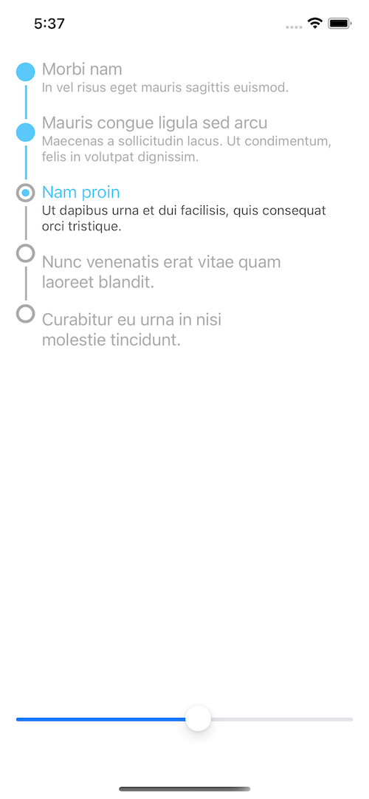

# StepProgressIndicatorView

[](https://cocoapods.org/pods/StepProgressIndicatorView)
[](https://cocoapods.org/pods/StepProgressIndicatorView)
[](https://cocoapods.org/pods/StepProgressIndicatorView)

<p align="center">

</p>

## Example

To run the example project, clone the repo, and run `pod install` from the Example directory first.


## Installation

StepProgressIndicatorView is available through [CocoaPods](https://cocoapods.org). To install
it, simply add the following line to your Podfile:

```ruby
pod 'StepProgressIndicatorView'
```


## Usage

```swift
let stepIndicatorView = StepProgressIndicatorView(frame: self.view.bounds)
stepIndicatorView.stepTitles = ["One", "Two", "Three", "Four"]
stepIndicatorView.details = [0: "First", 1: "Second"]
stepIndicatorView.direction = .topToBottom // set direction leftToRight, topToBottom ...
stepIndicatorView.currentStep = 0 // set 
        
```

## Appearance

**Fonts and sizes:**

```swift
stepIndicatorView.textFont = .systemFont(ofSize: 16)
stepIndicatorView.detailFont = .systemFont(ofSize: 12)    
```


**line sizes:**

```swift
stepIndicatorView.lineStrokeWidth = 2.0
stepIndicatorView.lineMargin = 4.0
stepIndicatorView.lineWidth = 1.0

stepIndicatorView.verticalPadding = 3
stepIndicatorView.horizontalPadding = 4
```

**Change Colors:**

```swift
stepIndicatorView.circleColor = .lightGray
stepIndicatorView.circleTintColor = .systemTeal

stepIndicatorView.currentTextColor = .black
stepIndicatorView.pastTextColor = .black
stepIndicatorView.futureTextColor = .lightGray
stepIndicatorView.currentDetailColor = .black

stepIndicatorView.pastStepFillColor = .gray
stepIndicatorView.currentStepFillColor = .systemTeal
stepIndicatorView.futureStepFillColor = .lightGray

stepIndicatorView.lineColor = .lightGray
stepIndicatorView.lineTintColor = .gray
```

## Author

miiiiiin, min.songkyung@gmail.com

## License

StepProgressIndicatorView is available under the MIT license. See the LICENSE file for more info.
